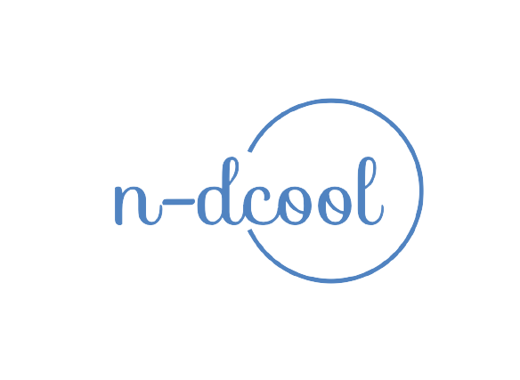

  
<b>📋 About</b>

  I like making things that stay on the Internet. \
  <i>Full Stack Developer.</i> \
  You can probably find more about on my website.

  [🌐 website](https://n-dcool.github.io/My-Terminal/ 'MY WEBSITEEEEEEEEEEEEEEEEE') \
  [📧 email](mailto:nareshnc82643@gmail.com 'MY EMAILLLLLLLLLL')

  
<b>📊 Some stats of me</b>

  
 \

  
<b>🚀 Deployments</b>

  <!---  -->
  
  | Project | Description | Link | GitHub |
  | :---: | :--- | :---: | :---: |
  |  | A minimalistic portfolio website designed to showcase my projects and skills in a sleek, terminal-inspired interface. | [My-Terminal](https://n-dcool.github.io/My-Terminal/) | [ GitHub ](https://github.com/N-dcool/My-Terminal) |
  |  | Share your favorite anime character voices, from Anya in Spy x Family and Renge Miyauchi in Non Non Biyori ! | [anya-vs-renge](https://anya-vs-renge.vercel.app/) | [GitHub](https://github.com/N-dcool/anya-vs-renge) |
  |  | Bloging and social media platform with Next.js and Firebase ~ inspired by sites Dev.to and Medium. | [blogging-webapp](https://blogging-webapp-kohl.vercel.app) | [ GitHub ](https://github.com/N-dcool/Blogging-webapp) |
  |  | Created own RESTfull API : Wiki - REST API | [wiki-api](https://wiki-api-git-main-n-dcool.vercel.app/articles) | [ GitHub ](https://github.com/N-dcool/Wiki-API) |
  

  

    
  
  
  &nbsp;&nbsp;
  
  
   
  
  
  &nbsp;&nbsp;
  
  
   

    
   
  
  &nbsp;&nbsp;&nbsp;&nbsp;
  
  &nbsp;&nbsp;&nbsp;&nbsp;
  
  &nbsp;&nbsp;&nbsp;&nbsp;
  
     

   &nbsp;&nbsp;&nbsp;&nbsp;

  
  

<!--  
   -->

<!--END_SECTION:waka-->
<!-- 
  ## <h1 align="center">💰 You can help me by Donating</h1>
  <h3 align="center">
  
  
  
  </h3>
  
Proudly created with GPRM ( https://gprm.itsvg.in )
 &nbsp;&nbsp;&nbsp;&nbsp; 
  -->
